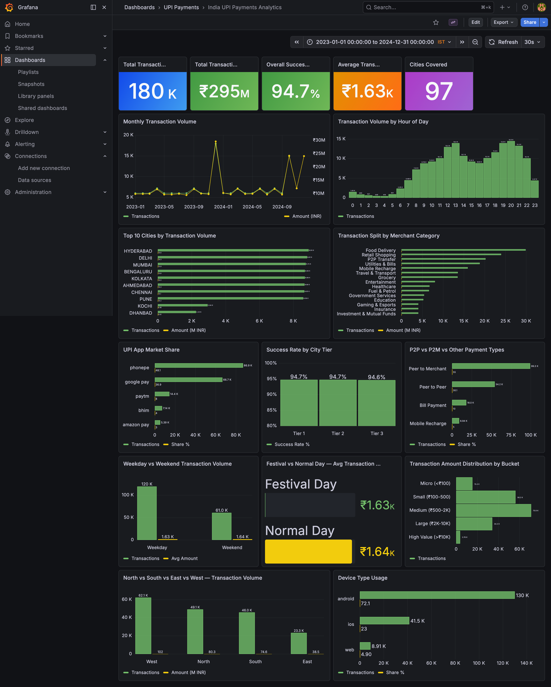

# India UPI Payments Analytics Pipeline

[](https://github.com/adhithyan-s/india-upi-payments-analytics/actions/workflows/ci.yml)


A production-style batch ELT pipeline modelling India's UPI payments ecosystem. Generates **180,000+ synthetic UPI transactions** across 97 Indian cities, stores them in a partitioned data lake, transforms them into an analytical star schema using dbt, and surfaces business KPIs through live Grafana dashboards.

India processed over **17 billion UPI transactions in a single month in 2024** - the largest real-time payments network in the world. This project builds the analytics layer that would power business intelligence for such a platform.

---



---

## Pipeline Architecture

```
Python Generator (synthetic UPI transactions)
        │
        ▼  Parquet — partitioned year=/month=/city=
MinIO Data Lake  ──────────────────────  Bronze layer
        │                                raw, immutable, source of truth
        ▼  Python loader reads Parquet -> cleans -> loads
PostgreSQL raw schema  ─────────────────  Silver layer
        │                                typed, validated, deduplicated
        ▼  dbt: staging -> intermediate -> marts
PostgreSQL marts schema  ───────────────  Gold layer
        │
        ├── fact_transactions  (180K+ rows)
        ├── dim_date           (731 rows — 2 years of days)
        ├── dim_location       (97 Indian cities)
        ├── dim_merchant       (15 categories)
        ├── dim_upi_app        (PhonePe, GPay, Paytm, BHIM, Amazon Pay)
        └── dim_payment_type   (P2P, P2M, Bill Payment, Recharge)
        │
        ▼  SQL queries, auto-refresh every 30s
Grafana Dashboards
```

---

## Tech Stack

| Layer | Tool | Why |
|---|---|---|
| Data generation | Python + NumPy + Faker | 180K+ realistic UPI transactions with Indian cities, merchant categories, and statistical distributions calibrated to NPCI data |
| Data lake | MinIO (S3-compatible) | Bronze layer: raw Parquet files, date+city partitioned, permanent source of truth. Identical boto3 API to AWS S3 - one env var to go to production |
| Transformation | dbt Core | ELT: staging -> intermediate -> star schema marts, with built-in testing and lineage |
| Warehouse | PostgreSQL 15 | Gold layer: analytical star schema serving Grafana dashboards |
| Dashboards | Grafana | 17 KPI panels provisioned as code - version-controlled dashboard JSON |
| Orchestration | Makefile | `make pipeline` runs the full stack end to end |
| Infrastructure | Docker + docker-compose | One-command setup for all services |
| CI/CD | GitHub Actions | flake8 + pytest + dbt test on every push |

---

## Star Schema

```
                    dim_date
                   (731 rows)
                       │
dim_location ──── fact_transactions ──── dim_merchant
 (97 cities)       (180K+ rows)         (15 categories)
                       │
             ┌─────────┴──────────┐
         dim_upi_app        dim_payment_type
          (5 apps)              (4 types)
```

**fact_transactions** - one row per UPI transaction, grain: one transaction
- Measures: `amount_inr`, `is_success`, `is_success_int`
- Foreign keys to all five dimension tables
- Denormalised attributes for Grafana filtering: `time_of_day`, `amount_bucket`, `is_weekend`, `is_festival`, `device_type`

**dim_location** - 97 Indian cities with state, region, tier (1/2/3), and metro classification

**dim_date** - full calendar table with weekday, month, quarter, `is_weekend`, `is_festival_day` (Diwali, Holi, Republic Day, etc.), Indian fiscal quarter, and season

**dim_merchant** - 15 UPI merchant categories: Food Delivery, Retail, P2P Transfer, Utilities, Travel, Healthcare, and more

**dim_upi_app** - PhonePe (48%), Google Pay (37%), Paytm (8%), BHIM (4%), Amazon Pay (3%) - weighted by real NPCI market share data

**dim_payment_type** - P2M (Peer to Merchant), P2P (Peer to Peer), Bill Payment, Mobile Recharge

---

## Key Engineering Decisions

**ELT over ETL** - Raw Parquet files land in MinIO unchanged (Load), then dbt transforms them using PostgreSQL's SQL engine (Transform). If transformation logic changes, re-running dbt against the unchanged Bronze files gives correct results - no re-extraction needed.

**Medallion architecture** - Bronze in MinIO is never modified. Silver in PostgreSQL is the cleaned individual record layer. Gold (dbt marts) is the analytical star schema. If a Gold model has a bug, fix the dbt model and re-run - raw data is always safe.

**Idempotent writes at every layer** - MinIO PUT overwrites the same key. PostgreSQL loader uses `ON CONFLICT DO NOTHING`. dbt incremental uses `unique_key` with upsert. Running the pipeline twice always produces the same result.

**Parquet + Hive partitioning** - `year=/month=/city=` partition structure enables partition pruning. A query filtering on month and city reads only matching folders - no full table scan. Same data: ~10GB as CSV, ~15MB as Parquet with Snappy compression.

**MinIO mirrors AWS S3** - identical boto3 API, same bucket/key model, same PUT/GET operations. Switching to production AWS S3 requires changing one environment variable. Zero code changes.

**dbt for transformation** - models are version-controlled SQL, dependencies are inferred from `ref()` calls automatically, and 46 data quality tests run on every CI push. Any test failure blocks deployment.

---

## Grafana Dashboards

17 panels across the full dashboard:

- Transaction volume trend - monthly time series with Diwali spikes visible
- Hour-of-day heatmap - UPI peaks at lunch (12-13h) and evening (20-21h)
- Top 10 cities by volume - Hyderabad, Delhi, Mumbai leading
- Merchant category breakdown - Food Delivery and Retail dominating
- UPI app market share - PhonePe 48%, GPay 37% matching real data
- Success rate by city tier - consistent ~94.7% across Tier 1/2/3
- Payment type split - P2M dominant, P2P significant
- Weekday vs weekend volumes - ~20% higher on weekends
- Festival vs normal day average amounts
- Transaction amount buckets - Micro to High Value distribution
- Regional split - West/North/South/East comparison
- Device type - Android 72%, iOS 23%, Web 5%

---

## dbt Model Lineage

```
sources (raw.transactions)
    └── staging/
        └── stg_transactions          <- deduplicate, type-cast, standardise
            ├── intermediate/
            │   └── int_transactions_enriched  <- derive time_of_day, amount_bucket
            └── marts/
                ├── fact_transactions  <- incremental, 180K+ rows
                ├── dim_date           <- generated date spine + festival dates
                ├── dim_location       <- 97 Indian cities
                ├── dim_merchant       <- 15 categories
                ├── dim_upi_app        <- 5 apps
                └── dim_payment_type   <- 4 types
```

---

## Data Quality Tests

46 dbt tests run automatically in CI/CD on every push:

| Test type | What it checks |
|---|---|
| `unique` | No duplicate surrogate or natural keys |
| `not_null` | Critical columns never null |
| `accepted_values` | Status, tier, merchant category within valid set |
| `relationships` | Every FK in fact table exists in its dimension |
| `assert_no_negative_amounts` | Custom SQL - no transaction amount ≤ ₹0 |
| `assert_success_rate_above_threshold` | Overall success rate stays above 85% |

---

## Quick Start

### Prerequisites
- Docker Desktop running
- Python 3.11+
- Git

### Setup

```bash
git clone https://github.com/adhithyan-s/india-upi-payments-analytics.git
cd india-upi-payments-analytics

python -m venv .venv
source .venv/bin/activate
pip install -r requirements.txt

cp .env.example .env
```

### Start services

```bash
make up
```

| Service | URL | Credentials |
|---|---|---|
| MinIO Console | http://localhost:9001 | minioadmin / minioadmin |
| Grafana | http://localhost:3000 | admin / admin |
| PostgreSQL | localhost:5433 | upiuser / upipassword / upidb |

### Run the pipeline

```bash
make pipeline
```

Or step by step:

```bash
make generate    # Python -> Parquet -> MinIO (Bronze)
make load        # MinIO -> PostgreSQL raw schema (Silver)
make dbt-run     # dbt builds star schema (Gold)
make dbt-test    # 46 data quality tests
```

### View dashboards

Open http://localhost:3000 -> Dashboards -> UPI Payments -> India UPI Payments Analytics

### Explore the data lake

Open http://localhost:9001 -> upi-lake bucket -> browse `year=/month=/city=` partition structure

---

## Project Structure

```
india-upi-payments-analytics/
├── generator/
│   ├── config.py                   # Indian cities, merchant categories, distributions
│   └── generate_transactions.py    # Synthetic UPI data -> Parquet -> MinIO
├── loader/
│   └── load_to_postgres.py         # MinIO Parquet -> PostgreSQL raw schema
├── dbt_project/
│   ├── models/
│   │   ├── staging/                # Clean, deduplicate, standardise
│   │   ├── intermediate/           # Enrich, derive fields
│   │   └── marts/                  # Star schema (fact + 5 dims)
│   ├── tests/                      # Singular data quality tests
│   ├── dbt_project.yml
│   └── profiles.yml.example
├── monitoring/
│   └── grafana/provisioning/       # Datasources + dashboards as code
├── tests/                          # pytest unit tests (37 tests)
├── docs/                           # Screenshots
├── .github/workflows/ci.yml        # GitHub Actions CI/CD
├── docker-compose.yml
├── init_db.sql
├── Makefile
├── requirements.txt
└── README.md
```

---

## CI/CD

GitHub Actions runs on every push to `main`:

1. Start MinIO binary + PostgreSQL service container
2. `flake8` - Python linting
3. `pytest` - 37 unit tests for generator and loader
4. Initialise PostgreSQL schemas
5. Generate 50,000 test transactions
6. Load into PostgreSQL
7. `dbt run` - build all 8 models
8. `dbt test` - run all 46 data quality tests

---

## About

Built as a portfolio project demonstrating production-style data engineering tools common in India's fintech and analytics industry.

Data is entirely synthetic - generated using Faker and NumPy with distributions calibrated to NPCI's published UPI statistics. Real transaction data is confidential by nature, so a well-built simulator is both necessary and a demonstration of data modelling thinking.